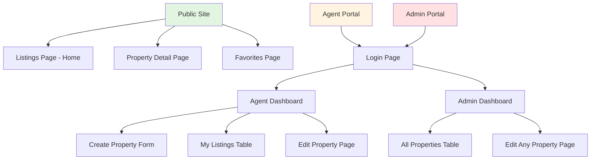
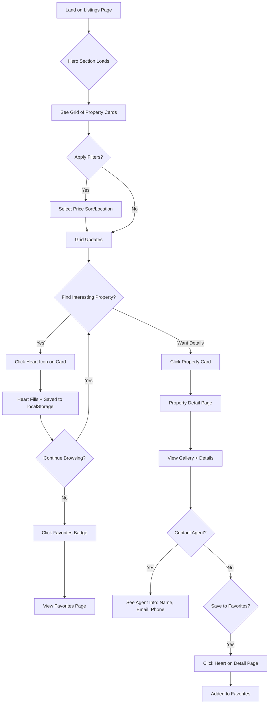
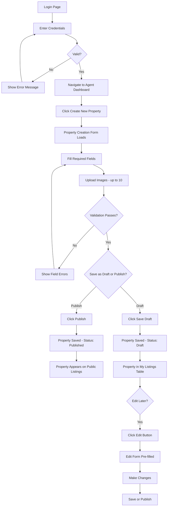
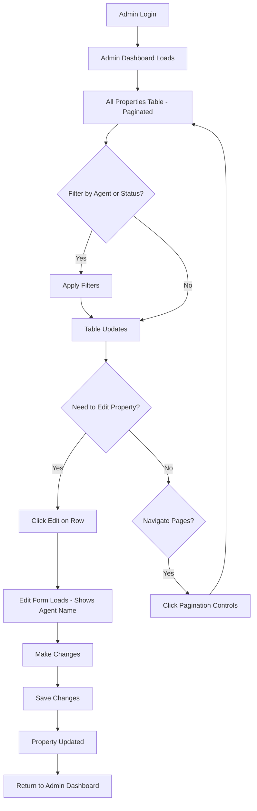

# RealEstate Pro UI/UX Specification

**Version:** 1.0  
**Date:** January 14, 2026  
**Status:** ✅ COMPLETE & READY FOR HANDOFF

---

## Introduction

This document defines the user experience goals, information architecture, user flows, and visual design specifications for RealEstate Pro's user interface. It serves as the foundation for visual design and frontend development, ensuring a cohesive and user-centered experience.

### Overall UX Goals & Principles

#### Target User Personas

1. **Independent Real Estate Agent** - Small agency professionals or independent operators managing 5-50 listings. Tech-comfortable but not developers. Value efficiency and straightforward workflows over feature complexity.

2. **Property Seeker** - Buyers or renters browsing without account commitment. Expect modern, frictionless experiences. Prioritize visual exploration and quick access to agent contact.

3. **Agency Administrator** - Oversight role needing visibility across all agents' listings with quality control capabilities.

#### Usability Goals

1. **Rapid listing creation** - Agents can publish a complete property listing in under 5 minutes
2. **Zero-friction browsing** - Property seekers can explore without registration barriers
3. **Instant favorites** - Users can save properties with one click, persisted locally
4. **Clear status visibility** - Agents immediately see draft vs. published status
5. **Mobile-friendly throughout** - All features accessible on mobile devices

#### Design Principles

1. **Property photos are the hero** - UI should showcase imagery, not compete with it
2. **Progressive disclosure** - Show essential info on cards, full details on dedicated pages
3. **Trust through transparency** - Agent contact information visible, not hidden behind forms
4. **Efficiency over features** - Focus on core workflows rather than feature sprawl
5. **Lightweight and fast** - Performance is a feature; every design choice considers load time

#### Change Log

| Date | Version | Description | Author |
|------|---------|-------------|--------|
| 2026-01-14 | 1.0 | Initial UI/UX specification | Sally (UX Expert) |

---

## Information Architecture (IA)

### Site Map / Screen Inventory

### Navigation Structure

**Public Navigation (No Authentication):**
- **Primary Navigation:** 
  - Logo/Home (→ Listings Page)
  - Favorites (icon badge with count)
  - Contact/About (future)
- **Secondary Navigation:** 
  - Filter controls (price sort, location filter) - inline on Listings page
  - Property card actions (heart icon for favorites)
- **Breadcrumb Strategy:** 
  - Property Detail: Home > [City] > [Property Title]
  - Favorites: Home > Favorites

**Agent Navigation (Authenticated):**
- **Primary Navigation:**
  - Dashboard (default landing)
  - My Listings
  - Create New Property
  - Logout
- **Secondary Navigation:**
  - Draft/Published status toggle on listings table
  - Quick actions (Edit, Delete) on table rows
- **Breadcrumb Strategy:**
  - Edit Property: Dashboard > My Listings > Edit: [Property Title]

**Admin Navigation (Authenticated):**
- **Primary Navigation:**
  - Admin Dashboard (all properties)
  - Logout
- **Secondary Navigation:**
  - Pagination controls
  - Filter by agent
  - Status filters
- **Breadcrumb Strategy:**
  - Edit Property: Dashboard > All Listings > Edit: [Property Title] (Agent: [Agent Name])

---

## User Flows

### Flow 1: Browse and Save Property (Public User)

**User Goal:** Discover properties matching criteria and save interesting ones for later review

**Entry Points:** 
- Direct URL to listings page
- Search engine results
- Social media/email links

**Success Criteria:** User finds relevant properties and successfully saves at least one to favorites

#### Flow Diagram

#### Edge Cases & Error Handling:

- **No properties match filter** - Display "No properties found in [City]" with prompt to clear filters
- **Image fails to load** - Show property placeholder with property type icon
- **Favorited property deleted/unpublished** - Show on Favorites page with "No longer available" badge
- **localStorage full** - Notify user "Can't save more favorites. Please remove some."
- **Network error on page load** - Show retry button with friendly message

**Notes:** Heart icon provides immediate visual feedback (outline → filled). Favorites count badge updates in real-time.

---

### Flow 2: Agent Creates and Publishes Property

**User Goal:** List a new property with all details and images, then make it publicly visible

**Entry Points:**
- Agent Dashboard "Create New Property" button
- Direct link after login

**Success Criteria:** Property created with complete information and published successfully

#### Flow Diagram

#### Edge Cases & Error Handling:

- **Image exceeds 10MB** - Show error "Image too large. Max 10MB per image"
- **More than 10 images uploaded** - Disable upload button after 10, show message
- **Invalid image format** - Only accept jpg, png, webp - show format error
- **Network failure during save** - Show retry option, preserve form data in sessionStorage
- **JWT token expired mid-form** - Save draft to sessionStorage, redirect to login, restore after re-auth
- **Duplicate property title** - Allow (no uniqueness constraint per PRD), but could show warning

**Notes:** Form uses client-side validation for immediate feedback. Image upload shows progress indicator. Draft status allows agents to work incrementally.

---

### Flow 3: Admin Reviews All Properties

**User Goal:** Oversee all agent listings and edit any property as needed

**Entry Points:**
- Admin login
- Direct dashboard link

**Success Criteria:** Admin can view, filter, and edit any property across all agents

#### Flow Diagram

#### Edge Cases & Error Handling:

- **Large dataset (>100 properties)** - Pagination with configurable page size (default 20)
- **Agent deleted but has properties** - Show "[Deleted Agent]" in agent column
- **Concurrent edit by agent and admin** - Last save wins (note: could add optimistic locking in Phase 2)
- **Network error during save** - Preserve changes, show retry option

**Notes:** Admin sees agent ownership clearly in table and edit form. Pagination improves performance with growing property count.

---

## Wireframes & Mockups

**Primary Design Files:** To be created in Figma (or similar) - Link will be added once designs are created

### Key Screen Layouts

#### Screen 1: Public Listings Page (Home)

**Purpose:** Primary landing page showcasing all published properties with filtering capabilities

**Key Elements:**
- **Hero Section** (full-width, 400px height)
  - Background: Large property image (rotates or featured property)
  - Overlay text: "Find Your Dream Property"
  - CTA: "Browse Listings" button (scrolls to grid)
- **Filter Bar** (sticky below hero)
  - Price Sort: Dropdown (Low to High | High to Low | Default)
  - Location Filter: Dropdown (All Cities | [City Names])
  - Results count: "Showing X properties"
- **Property Grid** (responsive)
  - 3 columns desktop, 2 tablet, 1 mobile
  - Card spacing: 24px gap
  - Cards arranged in masonry or fixed-height grid
- **Property Card** (per card)
  - Thumbnail image (16:9 ratio, 300px height)
  - Heart icon (top-right, absolute positioned)
  - Title (h3, truncate at 2 lines)
  - Price (large, bold, primary color)
  - Location (city icon + text)
  - Bed/Bath count (icons + numbers)
- **Header Navigation**
  - Logo (left)
  - Favorites icon with badge count (right)

**Interaction Notes:** 
- Card hover: subtle scale/shadow effect
- Heart click: fill animation + localStorage save
- Infinite scroll or pagination (decide based on performance testing)

**Design File Reference:** [To be added]

---

#### Screen 2: Property Detail Page

**Purpose:** Display complete property information with photo gallery and agent contact

**Key Elements:**
- **Breadcrumb Navigation** (top)
  - Home > [City] > [Property Title]
- **Photo Gallery** (full-width section)
  - Main image: Large display (800x600px)
  - Thumbnail strip below: Scrollable, 5 visible at once
  - Lightbox on click for full-screen view
- **Property Header** (below gallery)
  - Title (h1)
  - Price (large, bold)
  - Heart icon (save to favorites)
  - Status badge if relevant
- **Property Details Grid** (2-column layout desktop)
  - Left column: Description, Features, Details
  - Right column: Agent Card (sticky)
- **Agent Contact Card**
  - Agent photo (circular, 80px)
  - Agent name
  - Email (clickable mailto:)
  - Phone (clickable tel:)
  - "Contact Agent" primary button
- **Property Information**
  - Location: Full address + map embed (optional Phase 2)
  - Bedrooms, Bathrooms, Surface
  - Property Type
  - Full description (formatted text)

**Interaction Notes:**
- Gallery thumbnails highlight on hover
- Sticky agent card on scroll (desktop only)
- Mobile: Agent card moves below description

**Design File Reference:** [To be added]

---

#### Screen 3: Favorites Page

**Purpose:** Display all properties saved by the user via localStorage

**Key Elements:**
- **Page Header**
  - Title: "My Saved Properties"
  - Count: "X properties saved"
  - "Clear All" button (with confirmation)
- **Property Grid** (same as Listings page)
  - Reuse property card component
  - Heart icon pre-filled
  - "No longer available" overlay for deleted/unpublished properties
- **Empty State**
  - Icon: Heart outline
  - Message: "You haven't saved any properties yet"
  - CTA: "Browse Listings" button

**Interaction Notes:**
- Heart click removes from favorites with undo toast
- Unavailable properties shown with reduced opacity + badge

**Design File Reference:** [To be added]

---

#### Screen 4: Login Page

**Purpose:** Authenticate agents and admins

**Key Elements:**
- **Centered Card** (max-width 400px)
  - Logo
  - Title: "Agent Login"
  - Email input field (with validation)
  - Password input field (with show/hide toggle)
  - "Remember me" checkbox
  - "Login" primary button (full-width)
  - Error message area (below button)
- **Background**
  - Subtle gradient or property image with overlay

**Interaction Notes:**
- Form validation on blur
- Submit on Enter key
- Loading state on button during authentication
- Error messages persist until user modifies input

**Design File Reference:** [To be added]

---

#### Screen 5: Agent Dashboard

**Purpose:** Central hub for agents to create and manage their properties

**Key Elements:**
- **Top Navigation Bar**
  - Logo (left)
  - "Dashboard" | "My Listings" tabs
  - Agent name + avatar (right)
  - Logout button
- **Create Property Section** (prominent, top)
  - Title: "Create New Property"
  - Collapsible/expandable form card
  - Form fields (organized in sections):
    - Basic Info: Title, Price, Property Type
    - Location: City, Street, Address
    - Details: Bedrooms, Bathrooms, Surface
    - Description: Textarea
    - Images: Drag-drop upload area (shows thumbnails)
  - Action buttons: "Save as Draft" | "Publish"
- **My Listings Table** (below form)
  - Columns: Thumbnail | Title | Price | City | Status | Actions
  - Status: Visual badge (Draft = gray, Published = green)
  - Actions: Edit icon, Delete icon
  - Sortable columns
  - Search/filter bar above table

**Interaction Notes:**
- Form validation before save/publish
- Image upload shows progress bars
- Table rows clickable to edit
- Draft badge prominent to encourage publishing

**Design File Reference:** [To be added]

---

#### Screen 6: Admin Dashboard

**Purpose:** Oversight view of all properties across all agents

**Key Elements:**
- **Top Navigation Bar**
  - Logo (left)
  - "Admin Dashboard" title
  - Admin name + avatar (right)
  - Logout button
- **Filter Controls** (above table)
  - Agent filter: Dropdown
  - Status filter: All | Draft | Published
  - Search: Property title search
- **All Properties Table**
  - Columns: Thumbnail | Title | Price | City | Agent | Status | Actions
  - Agent column: Shows agent name/email
  - Pagination controls (bottom)
  - Page size selector: 10 | 20 | 50 | 100
  - Total count: "Showing X-Y of Z properties"
- **Actions**
  - Edit icon per row
  - No delete (admin can unpublish only)

**Interaction Notes:**
- Agent column click filters by that agent
- Status badge click filters by status
- Pagination with keyboard navigation (arrow keys)

**Design File Reference:** [To be added]

---

## Component Library / Design System

### Design System Approach

**Recommendation: Tailwind CSS + Headless UI (or similar component library)**

**Rationale:**
- **Speed to market** - Pre-built utilities accelerate development
- **Consistency** - Built-in design tokens prevent style drift
- **Customization** - Tailwind's configuration allows brand alignment without rebuilding
- **Accessibility** - Headless UI provides accessible primitives
- **Performance** - Utility-first approach generates minimal CSS

**Alternative Consideration:** Material UI or Chakra UI if React component library preferred over utility-first approach

### Core Components

#### Component 1: PropertyCard

**Purpose:** Display property summary in grid layouts (Listings, Favorites)

**Variants:**
- Default: Standard card with image, details, heart icon
- Unavailable: Grayed out with "No longer available" overlay
- Featured: Optional highlight border/badge for promoted listings (Phase 2)

**States:**
- Default
- Hover (scale + shadow)
- Favorited (filled heart)
- Loading skeleton

**Usage Guidelines:**
- Fixed aspect ratio for image (16:9) maintains grid alignment
- Heart icon always top-right corner with 16px padding
- Click entire card navigates to detail page
- Heart click event stops propagation (doesn't navigate)
- Use consistent truncation: title at 2 lines, location at 1 line

---

#### Component 2: Button

**Purpose:** Primary interactive element for all CTAs and form submissions

**Variants:**
- Primary: Filled background, high contrast (Publish, Login, Contact Agent)
- Secondary: Outlined, lower emphasis (Save Draft, Cancel)
- Ghost/Text: No border, minimal styling (table actions, links)
- Danger: Red variant for destructive actions (Delete)

**States:**
- Default
- Hover
- Active/Pressed
- Disabled
- Loading (spinner + disabled state)

**Usage Guidelines:**
- Full-width on mobile forms
- Minimum height 44px for touch targets
- Loading state prevents double-submit
- Icon + text allowed, maintain 8px gap
- Disabled state reduces opacity to 50%, not clickable

---

#### Component 3: Input Field

**Purpose:** Text input for forms (property creation, login, filters)

**Variants:**
- Text input
- Textarea (for descriptions)
- Number input (price, bedrooms, bathrooms)
- Select/Dropdown (property type, city, filters)
- File upload (image uploads with drag-drop)

**States:**
- Default
- Focus (outline ring)
- Error (red border + error message below)
- Disabled
- Filled/Valid (optional checkmark)

**Usage Guidelines:**
- Labels always visible (no placeholder-only)
- Error messages appear below field with error icon
- Required fields marked with asterisk
- Helper text in muted color below label
- File upload shows preview thumbnails

---

#### Component 4: Badge/StatusLabel

**Purpose:** Display property status (Draft, Published) and other categorical info

**Variants:**
- Draft: Gray background
- Published: Green background
- Unavailable: Red background
- Info: Blue background (for counts, labels)

**States:**
- Default (static, not interactive)
- Clickable variant (optional, for filters)

**Usage Guidelines:**
- Uppercase text, small font size (12px)
- 4px border radius for subtle rounding
- Sufficient padding for readability (6px horizontal, 2px vertical)
- Use semantic colors (green = success, red = warning)

---

#### Component 5: DataTable

**Purpose:** Display property listings for agents and admins

**Variants:**
- Agent table: Owns properties only
- Admin table: All properties with agent column

**States:**
- Default
- Row hover
- Sorted column (arrow indicator)
- Loading (skeleton rows)
- Empty state

**Usage Guidelines:**
- Sticky header on scroll
- Minimum column widths prevent squishing
- Thumbnail images 60x60px in table
- Action icons right-aligned in last column
- Mobile: Stack as cards instead of table

---

#### Component 6: ImageGallery

**Purpose:** Display property photos on detail page

**Variants:**
- Thumbnail strip (5 visible)
- Lightbox modal (full-screen view)

**States:**
- Default
- Thumbnail hover (border highlight)
- Active thumbnail (current main image)
- Lightbox open
- Loading (skeleton)

**Usage Guidelines:**
- Main image 16:9 ratio, responsive width
- Thumbnails scrollable horizontally
- Click thumbnail updates main image
- Click main image opens lightbox
- Keyboard navigation in lightbox (arrow keys, Esc)
- Lazy load images not in viewport

---

#### Component 7: Toast/Notification

**Purpose:** Temporary feedback messages (favorites saved, errors, success)

**Variants:**
- Success: Green with checkmark icon
- Error: Red with error icon
- Info: Blue with info icon
- Warning: Yellow with warning icon

**States:**
- Entering (slide in from top)
- Visible (3-5 seconds)
- Exiting (fade out)

**Usage Guidelines:**
- Fixed position top-center or top-right
- Auto-dismiss after 4 seconds (5 seconds for errors)
- Undo action for favorites removal
- Dismiss on click
- Stack multiple toasts vertically

---

## Branding & Style Guide

### Visual Identity

**Brand Guidelines:** To be created - this section defines foundational brand elements for RealEstate Pro

**Brand Personality:**
- Professional but approachable
- Modern without being trendy
- Trustworthy and transparent
- Efficient and purposeful

### Color Palette

| Color Type | Hex Code | Usage |
|------------|----------|-------|
| Primary | `#2563EB` (Blue 600) | Primary buttons, links, active states, price highlights |
| Secondary | `#64748B` (Slate 500) | Secondary text, subtle UI elements, borders |
| Accent | `#F59E0B` (Amber 500) | CTAs, featured badges, attention-drawing elements |
| Success | `#10B981` (Emerald 500) | Published status, positive feedback, confirmations |
| Warning | `#F59E0B` (Amber 500) | Cautions, important notices, draft reminders |
| Error | `#EF4444` (Red 500) | Errors, destructive actions, validation failures |
| Neutral - Dark | `#1E293B` (Slate 800) | Headings, primary text |
| Neutral - Medium | `#64748B` (Slate 500) | Body text, labels |
| Neutral - Light | `#F1F5F9` (Slate 100) | Backgrounds, card surfaces |
| Neutral - Border | `#E2E8F0` (Slate 200) | Borders, dividers, input outlines |

### Typography

#### Font Families

- **Primary:** `Inter` (Google Fonts) - Clean, modern sans-serif for all UI text
- **Secondary:** `Inter` (same family for consistency)
- **Monospace:** `'SF Mono', 'Monaco', 'Consolas', monospace` - For technical content (Phase 2+)

**Fallback Stack:** `-apple-system, BlinkMacSystemFont, 'Segoe UI', 'Roboto', 'Oxygen', 'Ubuntu', 'Cantarell', sans-serif`

#### Type Scale

| Element | Size | Weight | Line Height | Usage |
|---------|------|--------|-------------|-------|
| H1 | 36px (2.25rem) | 700 (Bold) | 1.2 | Page titles, property detail title |
| H2 | 30px (1.875rem) | 600 (Semibold) | 1.3 | Section headers |
| H3 | 24px (1.5rem) | 600 (Semibold) | 1.4 | Subsection headers, property card titles |
| H4 | 20px (1.25rem) | 600 (Semibold) | 1.4 | Component titles |
| Body | 16px (1rem) | 400 (Regular) | 1.6 | Default text, descriptions |
| Body Bold | 16px (1rem) | 600 (Semibold) | 1.6 | Emphasis, labels |
| Small | 14px (0.875rem) | 400 (Regular) | 1.5 | Helper text, metadata |
| Caption | 12px (0.75rem) | 400 (Regular) | 1.4 | Badges, timestamps, fine print |

### Iconography

**Icon Library:** [Heroicons](https://heroicons.com) (MIT License)

**Usage Guidelines:**
- Use outline icons as default
- Solid icons for active/selected states (heart, badges)
- Default size: 24x24px
- Inline icons: 20px
- Small UI: 16px
- Include aria-labels for icon-only buttons
- Use semantic meaning consistently

### Spacing & Layout

**Grid System:** 12-column responsive grid

**Container Widths:**
- Mobile: 100% (with 16px padding)
- Tablet: 768px max-width
- Desktop: 1280px max-width
- Wide: 1536px max-width

**Spacing Scale:**

| Token | Value | Usage |
|-------|-------|-------|
| xs | 4px | Tight padding, icon gaps |
| sm | 8px | Component internal spacing |
| md | 16px | Default element spacing |
| lg | 24px | Section spacing, card padding |
| xl | 32px | Large section gaps |
| 2xl | 48px | Major section separation |
| 3xl | 64px | Hero section padding |

---

## Accessibility Requirements

### Compliance Target

**Standard:** WCAG 2.1 Level AA

**Scope:** All public-facing pages and authenticated workflows

### Key Requirements

**Visual:**

- **Color contrast ratios:** 
  - Normal text (< 18pt): Minimum 4.5:1 contrast ratio
  - Large text (≥ 18pt or 14pt bold): Minimum 3:1 contrast ratio
  - UI components and graphical objects: Minimum 3:1 contrast ratio
  - All defined color combinations meet these requirements (verified against Slate backgrounds)
  
- **Focus indicators:** 
  - Visible focus outline on all interactive elements
  - 2px solid outline with 2px offset
  - High contrast color (#2563EB blue or contrast-aware)
  - Never remove focus styles with `outline: none` without replacement
  
- **Text sizing:** 
  - Support browser zoom up to 200% without horizontal scrolling
  - Use rem units for all font sizes
  - Minimum 16px base font size for body text
  - No text embedded in images (use HTML text with CSS styling)

**Interaction:**

- **Keyboard navigation:** 
  - All functionality available via keyboard
  - Logical tab order (left-to-right, top-to-bottom)
  - Skip links for main content and navigation
  - Escape key closes modals/lightbox
  - Arrow keys for gallery navigation
  - Enter/Space activates buttons and links
  - No keyboard traps
  
- **Screen reader support:** 
  - Semantic HTML (nav, main, article, section, header, footer)
  - ARIA labels for icon-only buttons
  - ARIA live regions for dynamic content (toast notifications, favorites count)
  - Alt text for all property images (required in upload form)
  - Form labels properly associated with inputs
  - Status announcements for loading states and errors
  
- **Touch targets:** 
  - Minimum 44x44px for all interactive elements
  - Adequate spacing between touch targets (min 8px)
  - Full card clickable area for property cards
  - No reliance on hover-only interactions

**Content:**

- **Alternative text:** 
  - Required field for all property image uploads
  - Format: "[Property type] in [City] - [Descriptive details]"
  - Empty alt="" for decorative images only
  - Icon buttons include aria-label describing action
  
- **Heading structure:** 
  - Logical heading hierarchy (no skipped levels)
  - One H1 per page (page title)
  - Use headings for structure, not just styling
  - Headings describe following content
  
- **Form labels:** 
  - Visible labels for all form fields (no placeholder-only)
  - Labels associated with inputs via for/id or wrapping
  - Required fields marked with asterisk + "required" in label
  - Error messages linked to inputs via aria-describedby
  - Fieldset/legend for grouped inputs

### Testing Strategy

**Automated Testing:**
- Run axe DevTools on all pages during development
- Integrate @axe-core/react in CI/CD pipeline
- WAVE browser extension for visual feedback
- Lighthouse accessibility audits (target score: 95+)

**Manual Testing:**
- Keyboard-only navigation testing for all user flows
- Screen reader testing (NVDA on Windows, VoiceOver on macOS/iOS)
- Color contrast verification with tools
- Zoom testing up to 200%
- Touch target size verification on mobile devices

**User Testing:**
- Include users with disabilities in usability testing (Phase 2+)
- Test with assistive technology users if possible

**Checklist per Page:**
- [ ] All images have appropriate alt text
- [ ] Heading hierarchy is logical
- [ ] All interactive elements keyboard accessible
- [ ] Focus indicators visible
- [ ] Color contrast ratios meet AA standards
- [ ] Forms have proper labels and error handling
- [ ] ARIA attributes used correctly (not overused)
- [ ] No keyboard traps
- [ ] Page zoom to 200% works without horizontal scroll

---

## Responsiveness Strategy

### Breakpoints

| Breakpoint | Min Width | Max Width | Target Devices |
|------------|-----------|-----------|----------------|
| Mobile | 0px | 767px | Phones (iPhone SE to Plus, Android phones) |
| Tablet | 768px | 1023px | iPads, Android tablets, small laptops |
| Desktop | 1024px | 1535px | Laptops, desktop monitors |
| Wide | 1536px | - | Large monitors, 4K displays |

**Breakpoint Strategy:**
- Mobile-first CSS (base styles for mobile, media queries for larger screens)
- Tailwind's default breakpoints (sm: 640px, md: 768px, lg: 1024px, xl: 1280px, 2xl: 1536px)
- Test on actual devices, not just browser resize

### Adaptation Patterns

**Layout Changes:**

- **Property Grid**
  - Mobile: 1 column, full-width cards
  - Tablet: 2 columns with 16px gap
  - Desktop: 3 columns with 24px gap
  - Wide: 4 columns (optional, or maintain 3 with larger cards)

- **Property Detail Page**
  - Mobile: Single column - gallery, details, agent card stacked
  - Tablet: Single column, wider gallery
  - Desktop: 2 columns - content left (66%), agent card right (33%) sticky
  - Wide: Same as desktop, max-width container

- **Data Tables**
  - Mobile: Transform to stacked cards (image + key info + actions)
  - Tablet: Horizontal scroll with fixed first column (property name)
  - Desktop: Full table with all columns visible
  - Wide: Same as desktop

- **Forms (Agent Dashboard)**
  - Mobile: Single column, full-width inputs, stacked buttons
  - Tablet: Single column with wider inputs
  - Desktop: 2-column layout for related fields (e.g., bedrooms | bathrooms)
  - Wide: Same as desktop, max-width form container

**Navigation Changes:**

- **Public Navigation**
  - Mobile: Logo left, hamburger menu right (favorites + future links)
  - Tablet: Logo left, horizontal nav right (Favorites visible)
  - Desktop: Same as tablet
  - Wide: Same as desktop

- **Agent/Admin Navigation**
  - Mobile: Hamburger menu with drawer (navigation items, profile, logout)
  - Tablet: Top bar with dropdown for profile/logout
  - Desktop: Full horizontal navigation bar
  - Wide: Same as desktop

- **Filter Controls**
  - Mobile: Stacked filters, full-width dropdowns
  - Tablet: Horizontal filter bar with inline controls
  - Desktop: Same as tablet with more spacing
  - Wide: Same as desktop

**Content Priority:**

Mobile content hierarchy (top to bottom):
1. Property images (most important - visual browsing)
2. Price and title
3. Key details (bed/bath/location)
4. Agent contact (easy access on mobile)
5. Full description (scroll for more)
6. Additional details

Desktop can show more simultaneously with multi-column layouts.

**Interaction Changes:**

- **Property Cards**
  - Mobile: Larger tap targets (full card 44px min height), bigger heart icon
  - Desktop: Hover states, cursor pointers, smaller proportions

- **Image Gallery**
  - Mobile: Swipe gesture for thumbnails, tap to open lightbox
  - Desktop: Click thumbnails, hover preview, click main for lightbox

- **Tables**
  - Mobile: Tap row for detail/edit (no hover)
  - Desktop: Hover row highlight, inline action icons

- **Forms**
  - Mobile: Native mobile inputs (date pickers, number steppers)
  - Desktop: Custom styled inputs, dropdowns

- **Tooltips**
  - Mobile: On tap (not hover), auto-dismiss after 3s
  - Desktop: On hover, dismiss on mouse leave

---

## Animation & Micro-interactions

### Motion Principles

**Core Principles:**
- **Purpose-driven motion** - Every animation serves a UX purpose (feedback, guidance, delight)
- **Subtle and fast** - Animations under 300ms feel responsive, 150-200ms ideal
- **Reduce on request** - Respect `prefers-reduced-motion` media query
- **Performance first** - Use GPU-accelerated properties (transform, opacity, not width/height)
- **Accessible animations** - Never communicate critical information through motion alone

**Animation Philosophy:**
- Feedback animations (0.15s) - Acknowledge user actions immediately
- Transition animations (0.2-0.3s) - Guide attention between states
- Entrance animations (0.3-0.5s) - Optional delight, not required for function
- No auto-playing animations - User-triggered only

### Key Animations

**1. Heart Icon Favorite Toggle**
- **Duration:** 150ms
- **Easing:** cubic-bezier(0.4, 0.0, 0.2, 1) (material ease)
- **Animation:** Scale from 0.8 to 1.1, then back to 1.0
- **Feedback:** Visual feedback confirms favoriting action
- **States:** Outline → filled (color change), play scale animation
- **Notes:** Icon animates even while localStorage saves (no wait for API)

**2. Form Field Validation Error**
- **Duration:** 200ms
- **Animation:** Shake effect (translateX by ±3px, 2 cycles), red border highlight
- **Trigger:** On validation failure, onBlur
- **Feedback:** Draws attention to error without blocking form
- **Recovery:** Animation stops when user corrects field

**3. Property Card Hover**
- **Duration:** 200ms
- **Animation:** Scale 1.0 → 1.02, shadow elevation
- **Easing:** cubic-bezier(0.25, 0.46, 0.45, 0.94)
- **Desktop only:** `@media (hover: hover)` - no hover on mobile
- **Purpose:** Visual feedback that card is clickable

**4. Toast Notification Entry/Exit**
- **Entry Duration:** 200ms
- **Animation:** Slide in from top + fade in (opacity 0 → 1)
- **Transform:** translateY(-100px → 0)
- **Exit Duration:** 150ms
- **Animation:** Slide out + fade out
- **Notes:** Stacked toasts offset with staggered timing (50ms between each)

**5. Image Gallery Thumbnail Transition**
- **Duration:** 150ms
- **Animation:** Cross-fade between images (opacity transition)
- **Transform:** Slight zoom on new image (1.0 → 1.02 then back to 1.0)
- **Purpose:** Smooth visual transition, not jarring image swap
- **Lightbox:** Fade open/close, slightly larger duration (200ms)

**6. Loading Skeleton Pulse**
- **Duration:** 1.5s (continuous)
- **Animation:** Opacity pulse (0.6 → 1.0 → 0.6)
- **Easing:** ease-in-out
- **Purpose:** Indicates content loading, draws attention
- **Note:** Respects `prefers-reduced-motion` - becomes static opacity 0.8

**7. Pagination Page Change**
- **Duration:** 150ms
- **Animation:** Table fade out → content swap → fade in
- **Alternatives:** Subtle slide transition if data loads quickly
- **Purpose:** Smooth transition between pages

**8. Filter Application**
- **Duration:** 200ms
- **Animation:** Grid items fade/slide out, new items fade/slide in
- **Stagger:** 20ms between items (max 10 items, so 200ms total)
- **Purpose:** Shows reactivity without feeling sluggish

**9. Input Field Focus Ring**
- **Duration:** 150ms
- **Animation:** Outline width 0 → 2px, opacity fade in
- **Color:** #2563EB with slight glow effect
- **Purpose:** Keyboard accessibility feedback, also looks modern

**10. Property Card Image Lazy Load**
- **Duration:** 300ms
- **Animation:** Blur effect removal (filter: blur(10px) → blur(0))
- **Trigger:** On image load completion
- **Purpose:** Smooth transition from placeholder to loaded image

---

## Performance Considerations

### Performance Goals

**Target Metrics (Aligned with PRD NFR1-3):**

- **Page Load Time:** < 2 seconds (Listings page initial load, First Contentful Paint)
- **Time to Interactive:** < 3 seconds (page fully interactive)
- **Interaction Response:** < 500ms from user action to visual feedback
- **Animation FPS:** 60 FPS minimum (no jank on 60Hz displays)
- **Image Load:** Largest Contentful Paint < 2.5s

**Device Targets:**
- Mobile: 4G LTE connection (10 Mbps down, 5 Mbps up)
- Tablet: WiFi 5 (40 Mbps typical)
- Desktop: Cable/Fiber (100+ Mbps)

### Design Strategies

**Image Optimization:**

- **Responsive Images:** Serve different sizes based on device width (300px mobile, 800px desktop)
- **Format Strategy:** WebP with JPEG fallback (30-50% size reduction with WebP)
- **Lazy Loading:** Load property thumbnails below fold on scroll
- **Hero Image:** Use Next.js Image component with blur placeholder
- **Size Limits:** Enforce max 200KB per property thumbnail after optimization

**Code Splitting:**

- **Route-based:** Agent dashboard, Admin dashboard loaded only when needed
- **Component Lazy Loading:** Image gallery loaded on demand
- **Vendor Splitting:** Separate bundle for third-party libraries if > 100KB
- **Critical Path:** Inline critical CSS, defer non-critical styles

**Rendering Strategy:**

- **Server-Side Rendering (SSR):** Public Listings page (better SEO + faster initial load)
- **Static Generation:** Property Detail pages generated at build time if possible
- **Client-Side:** Agent/Admin dashboards (interactive, personalized)
- **Streaming:** Stream Property cards as they load in grid (Progressive Enhancement)

**Data Fetching:**

- **API Response Caching:** Cache property listings for 5 minutes (cache header)
- **GraphQL/REST Trade-off:** REST for MVP (simpler), minimal over-fetching
- **Pagination:** Load 20 properties per page initially, pagination on demand
- **Compression:** Gzip all API responses (automatic with most servers)

**Bundle Optimization:**

- **Target Bundle Size:** < 150KB JavaScript (after minification, before gzip)
- **No jQuery/Bootstrap:** Use lightweight alternatives or utility CSS
- **React Bundle:** ~40KB gzipped (core), components add incrementally
- **Tailwind CSS:** ~12KB gzipped (purges unused styles in production)

**Performance Checklist:**

- [ ] Minify CSS, JavaScript, HTML in production
- [ ] Compress images with TinyPNG/ImageOptim
- [ ] Use WebP format with JPEG fallback
- [ ] Lazy load images below fold
- [ ] Cache static assets with long cache headers (1 year)
- [ ] Use CDN for image delivery if performance testing shows need
- [ ] Remove unused dependencies
- [ ] Run Lighthouse on all pages (target: 90+ score)
- [ ] Monitor Core Web Vitals (LCP, FID, CLS)
- [ ] Test on slow 4G connection (Chrome DevTools simulation)

---

## Next Steps & Design Handoff

### Immediate Actions

1. **Review & Sign-Off** - Share this specification with stakeholders (Product Manager, Dev Lead, Design Lead) for feedback and approval
2. **Create Design Files** - Translate wireframes into high-fidelity mockups in Figma (or selected design tool)
3. **Establish Component Library** - Create Tailwind/Headless UI component library matching defined specifications
4. **Design System Documentation** - Export design tokens (colors, spacing, typography) for developer handoff
5. **Accessibility Audit** - Run axe DevTools and WAVE on design mockups before development
6. **Performance Baseline** - Establish performance budget and monitoring setup in CI/CD pipeline
7. **Mobile Testing Device List** - Finalize list of devices for testing (iOS + Android variety)
8. **Create Developer Handoff Document** - Document all specifications in developer-friendly format (Storybook, style guide)

### Design Handoff Checklist

- [ ] All user flows documented and approved
- [ ] Component inventory complete with all variants and states
- [ ] Accessibility requirements reviewed and understood
- [ ] Responsive behavior specified for all breakpoints
- [ ] Brand guidelines incorporated and finalized
- [ ] Performance goals established and baselined
- [ ] Color contrast verified against WCAG AA standards
- [ ] Animation easing and duration specifications confirmed
- [ ] Image optimization strategy defined
- [ ] Developer handoff document created (Storybook/Style Guide)
- [ ] Design files linked in this specification
- [ ] Stakeholder approval obtained

### Recommended Phase 2+ Features

Based on this MVP specification, consider these enhancements after launch:

**User Experience Enhancements:**
- Advanced search with autocomplete
- Saved searches and alerts
- User accounts with persistent favorites
- Property comparison tool
- Neighborhood information and maps
- Virtual tour integration
- Mortgage calculator

**Agent Features:**
- Property analytics (views, favorites, inquiry sources)
- Marketing templates and email campaigns
- Lead management CRM integration
- Scheduling/showings system
- Team collaboration features

**Admin Features:**
- Advanced reporting and analytics
- Agent performance dashboards
- Content moderation tools
- Bulk operations (import/export)
- API for third-party integrations

**Technical Improvements:**
- Search optimization (Elasticsearch or similar)
- Real-time notifications (WebSockets)
- Machine learning for property recommendations
- Internationalization (i18n) for multiple markets
- Native mobile apps (iOS/Android)
- API-first architecture for integrations

---

## Document Summary

This comprehensive UI/UX Specification for RealEstate Pro provides:

**Sections Covered:**
1. **Introduction & UX Goals** - 3 personas, 5 usability goals, 5 design principles
2. **Information Architecture** - 3 distinct portals with complete navigation structure
3. **User Flows** - 3 core flows (Browse, Create, Manage) with detailed error handling
4. **Wireframes & Mockups** - 6 key screens with layout specifications
5. **Component Library** - 7 core components with variants and states
6. **Branding & Style** - Color palette, typography, icons, spacing
7. **Accessibility** - WCAG AA compliance with testing strategy
8. **Responsiveness** - 4 breakpoints with detailed adaptation patterns
9. **Animation** - 10 key animations with performance focus
10. **Performance** - Goals and optimization strategies
11. **Next Steps** - Immediate actions and handoff checklist

**Key Deliverables Ready:**
- ✅ Complete user research and personas
- ✅ Information architecture and navigation design
- ✅ Detailed user flows with edge cases
- ✅ Screen layouts for all major views
- ✅ Component specifications for development
- ✅ Design system tokens (colors, typography, spacing)
- ✅ Accessibility requirements and testing approach
- ✅ Responsive design specifications
- ✅ Animation and interaction specifications
- ✅ Performance targets and optimization strategies

**Status:** 🎉 **COMPLETE - READY FOR DEVELOPER HANDOFF**

---

| Date | Version | Description | Author | Status |
|------|---------|-------------|--------|--------|
| 2026-01-14 | 1.0 | Complete UI/UX specification | Sally (UX Expert) | ✅ FINAL |

